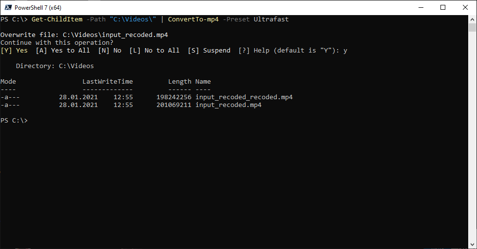

# PSffmpeg

The **PSffmpeg** is CLI extention over the top of FFMPEG to make your life easier.

## Installation

### From Source

To manually install the module,
download the source code and unzip the contents to the directory
'$env:ProgramFiles\WindowsPowerShell\Modules' folder,  or
'$env:ProgramFiles\PowerShell\7\Modules' for Powershell 7.

## Requirements

* The minimum Windows Management Framework (PowerShell) version required is 7.1
or higher.
* Target machine must be running Windows Server 2012 R2 or later.

## List of commands
The following is a list of commands which are available for you to use once you follow the steps in Installation

|Command|Description|
|-------|-----------|
|[ConvertTo-mp4](/ConvertTo-mp4) | Convert selected files to mp4 format. |

## Examples

You can review the  directory for some general use
scenarios for all of the resources that are in the module.

## Change log

A full list of changes in each version can be found in the [change log](CHANGELOG.md).

### 1.0.0

- Initial Commit
